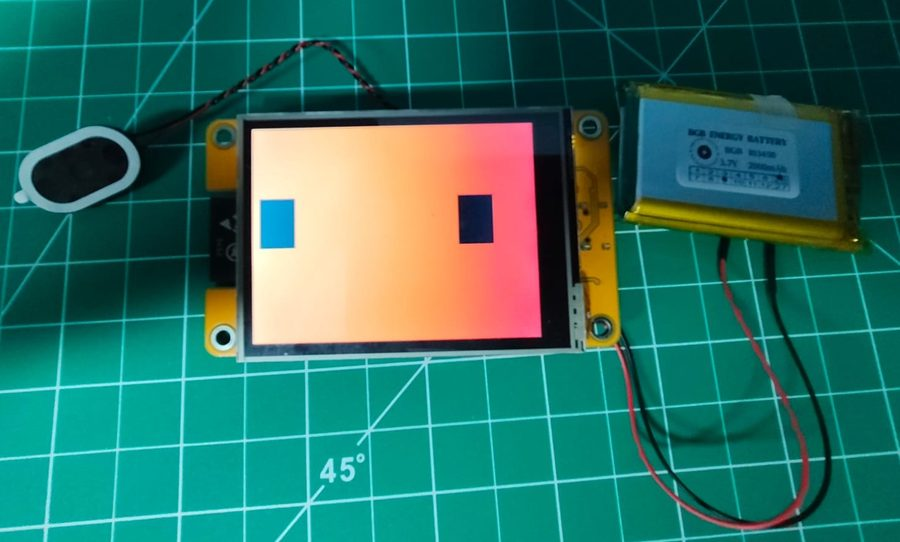
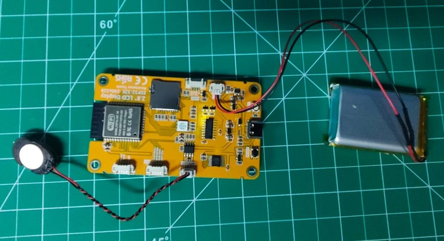
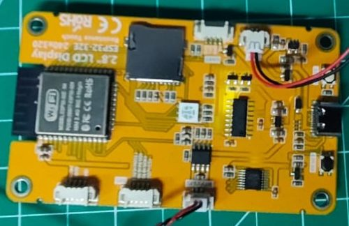
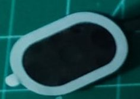
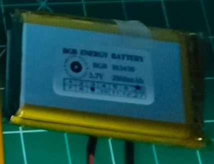
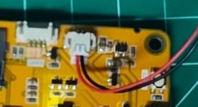
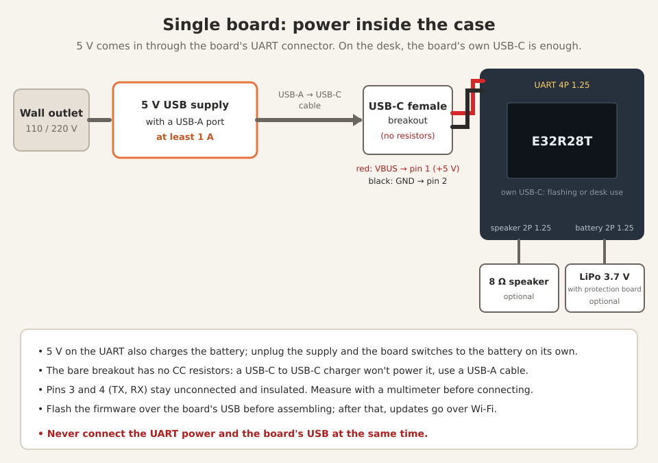

# Claudinho

**English** · [Português](README.pt-BR.md)

Claude Code's mascot, alive, on your desk.

https://github.com/user-attachments/assets/599573a4-2537-459c-81e3-0e593c2b9ad6

*The video shows the classic version (ESP32-C3 + Nextion).*

Claudinho is a Claude Code plugin that gives Clawd a body: an ESP32 with a
touch screen (the single-board E32R28T, recommended, or the classic ESP32-C3 +
Nextion) that reacts to what Claude is doing (thinking, using a tool,
waiting for you, done, error) and shows how much of your plan you've used in
the 5-hour and 7-day windows.

- **No external server or cloud service.** Your computer talks straight to
  the board over your local network. (The board only leaves your network to
  set its clock using a public NTP server.)
- **No Anthropic credentials.** Nothing Claudinho uses day to day needs a
  login, token or key from your account, and none is ever sent to the board:
  the numbers come from Claude Code's own status line.
- **Spends no tokens and doesn't slow Claude down.** Claude Code already
  offers two official ways to follow what it's doing: *hooks* (it runs a command
  when something happens) and the *status line* (it hands a command your plan
  numbers). Both run in the background, without going through the model, and
  Claudinho only uses them to send a short note over the network. (Talking to
  Claude about Claudinho, like the guided setup, is a conversation like any
  other and uses tokens.) Details in [How it works](#how-it-works).
- **Guided setup.** A skill flashes the firmware, sets up Wi-Fi and the
  screen, and tests everything. You just plug in the cable.
- **Voice and battery (single board).** On the E32R28T, Claudinho speaks a
  robot language of beeps through a small speaker, and runs on a battery
  charged by the board itself.
- **Optional: your Bambu Lab printer.** Claudinho can also connect straight
  to a Bambu 3D printer on your network and show a print panel plus alerts
  (started, paused and why, finished, failed...) that stay until you tap.
  Tested on the P2S. See the [manual](docs/manual.md#bambu-lab-printer-optional).

**[Hardware](#which-version) · [Installation](#installation) · [User manual](docs/manual.md)**

## Which version?

Claudinho runs on two kinds of hardware. For a new build, go with the
**single board (E32R28T)**.

| | [Single board: E32R28T](#single-board-recommended-e32r28t) | [Classic: ESP32-C3 + Nextion](#classic-version-esp32-c3--nextion) |
|---|---|---|
| Status | **recommended** for new builds | fully supported (the one in the video) |
| Hardware | one board: ESP32 with a 2.8" touch screen built in | ESP32-C3 Super Mini + Nextion 2.4" display |
| Soldering | none | 4 wires |
| Voice and battery | optional speaker and battery (charger on the board) | no (powered by a USB power supply) |
| Screen updates | part of the firmware | separate Nextion screen file (`.tft`) |
| 3D-printed case | being modeled right now, coming to MakerWorld soon | [on MakerWorld](https://makerworld.com/models/3365275-claudinho) |

## Single board (recommended): E32R28T

<p>
  
  
</p>

The **E32R28T** (LCDWiki "2.8inch ESP32-32E Display") is an ESP32 with a 2.8"
touch screen built in, 320×240. It simplifies a lot:

- **One board instead of two.** No wires to solder, no separate power for the
  display: plug in the USB and that's it.
- **No Nextion Editor and no `.tft`.** The ESP32 draws the screen itself, with
  the fonts built into the firmware (smoother, anti-aliased text). Setup has
  one fewer step, and updates only require flashing the firmware.
- **Battery with a charger on the board**, for a truly portable Claudinho: a
  battery icon on the usage card shows how much is left, and
  `claudinho.sh desligar` puts it into deep sleep (press BOOT to wake it), so the
  battery doesn't drain while it's put away.
- **It talks.** With a small speaker on the board's connector, Claudinho
  speaks a robot language of beeps and whistles. Nothing is recorded: every
  phrase is generated on the spot, so no two are alike, and the mood changes
  the intonation (happy when it wakes up, a question when Claude needs you,
  grumpy on an error, a quick "done!" when Claude finishes, sleepy at bedtime).

Everything works on it (faces, usage, scenes, printer, games, demo mode,
languages), and the setup skill recognizes the board on its own.

### Parts

| Part | Notes |
|---|---|
| [E32R28T board (ESP32 + 2.8" touch screen)](https://www.aliexpress.com/item/1005009659317465.html) | the resistive-touch version; listings may call it "ESP32-32E 2.8"<br> |
| [8 Ω speaker with a JST 1.25 plug](https://www.aliexpress.com/item/1005009194531045.html) | optional, for the voice; the small 2415 (24 × 15 mm) fits well<br> |
| 3.7 V LiPo battery with a **JST 1.25 mm 2-pin** plug and a protection board | optional. The one in the photos is a 103450 (10 × 34 × 51 mm, 2000 mAh): <br> <br>Other capacities work, but the size changes: check that it fits the case. Watch out for listings with the bigger 2.54 mm plug. **Check the polarity** before plugging it in (cheap batteries sometimes come reversed). |
| USB-C data cable | to set it up, flash it and charge it |
| 5 V USB power supply with a USB-A port, **at least 1 A** | for everyday use (a regular phone charger); in the case build, with a USB-A to USB-C cable |
| USB-C female breakout (bare, VBUS and GND) | for the case build: the power input on the case (see [Power](#power)) |
| 4-pin 1.25 mm cable | for the case build; comes with the board |

### Power

- **On the desk (bare board):** just the USB-C cable. No soldering.
- **Inside the Claudinho case:** the board is powered with **5 V** through its
  UART connector (the 4-pin, 1.25 mm pitch one, often sold as "MX1.25"):
  pin 1 is +5 V and pin 2 is GND in the board's schematic. The 4-pin cable
  that comes with the board goes from that connector to a bare USB-C female
  breakout on the case (VBUS to +5 V, GND to GND).
- **Which charger for the case:** these bare breakouts usually have no CC
  resistors (5.1 kΩ), so a USB-C to USB-C charger won't deliver power to them.
  Use a **USB-A to USB-C** cable and charger.
- **Battery:** the 5 V on that pin also charges the battery (the board's
  TP4054 charger is fed from the same +5 V rail). Unplug it and the board
  switches to the battery automatically.



> [!WARNING]
> **Flash it before assembling.** Before putting anything into the case,
> flash the base firmware over USB (the setup skill does it). After that,
> updates go over Wi-Fi, so you no longer need the USB port.
>
> **Power: one source only.** Check the markings on the board and measure
> with a multimeter before connecting anything to the UART connector.
> **Never** connect that external power and the board's USB cable at the same
> time: two sources fighting can damage the board or your computer's USB port.

### Notes

- **USB driver on Windows.** The board's USB chip is a CH340. If the port
  doesn't show up on Windows, install the CH340 driver.
- **Opening the USB port restarts the board.** That's how it gets flashed
  without pressing buttons. The screen may blink: that's normal.
- **ILI9341 or ST7789?** The board's spec sheet says ILI9341, but the screen
  is an ST7789. The firmware already knows.
- **Case:** its own case is being modeled right now and will be on MakerWorld
  soon. For now it's for people who don't mind a bare board.

## Warning: at your own risk

Soldering irons, power supplies and computer USB ports: a lot can go wrong,
and you might end up with a fried board, a fried screen or, worse, a fried
USB port on your computer. (During development, a test board got hot enough
to burn my finger. Nothing educational about it, it just hurt.)

So if you don't know what you're doing, stop, study a bit or ask someone who
does, and don't come blaming Claudinho or Argeu afterwards. The license (MIT)
already says this in a more boring way: the project comes "as is", without
warranty of any kind.

For the record: my high school degree is in electronics technology, and I
hold a master's and a PhD in *gambiarra* (Brazilian for "jury-rigging"). Or
rather: in low-cost, high-risk alternative technical solutions.

## Prerequisites

- **Claude Code**, on a system from [Tested environments](#tested-environments):
  tested end to end on WSL2 on Windows 11; written to work (not yet tested on
  real hardware) on native Linux, macOS and Windows with Git Bash. The scripts
  use `bash`, `curl` and `python3`.
- **The board** ([E32R28T](#single-board-recommended-e32r28t) or
  [classic](#classic-version-esp32-c3--nextion)) and a **USB data cable**
  (many cables are charge-only).
- **A 2.4 GHz Wi-Fi network.** The ESP32 can't see 5 GHz networks.

## Installation

1. Create a folder for the project and open Claude Code in it:

   ```bash
   mkdir ~/LittleClaude && cd ~/LittleClaude && claude
   ```

2. Add the marketplace and install the plugin (inside Claude Code):

   ```
   /plugin marketplace add argeuthiesen/claudinho
   /plugin install claudinho@claudinho
   ```

3. **Restart Claude Code.** The plugin's hooks only take effect after that
   (`/exit` and then `claude --continue` brings you back to the same
   conversation). Do the same whenever you update the plugin.

4. **Classic version only:** wire the ESP32 to the Nextion first (4 wires, see
   [Wiring](#wiring)). The single board needs nothing.

   Plug the board into your computer with the data cable and ask:

   ```
   /claudinho:configurar
   ```

   (The skill name is Portuguese for "configure"; Claude will talk to you in
   your own language.) The skill finds the board, automatically detects which
   version it is (single board or classic), flashes the firmware (~30 s),
   lists the Wi-Fi networks the board can see (2.4 GHz only) and asks you to
   run a command in a terminal, where you type the Wi-Fi password without it
   being shown: it never goes through the conversation with Claude and is
   stored **only on the board**. On the classic version, it then flashes the
   Nextion screen over the network (~40 s, asking for a tap on the screen).
   On the single board there are no wires to check and no Nextion step.
   Finally it enables the status line and runs a test.

5. Write down the IP and MAC the skill shows you and reserve that IP on your
   router (static DHCP). If the IP changes, run the skill again.

6. **The plan numbers show up after Claude's first response** in a session:
   that's when the status line receives the data. Until then, the faces
   already react.

After the first flash you no longer need the cable: the board can stay on
the power supply (or on the battery, on the single board).

### Status line

Plugins can't enable the status line on their own; the skill does it for
you, backing up `~/.claude/settings.json`. If you already had a status line,
it's still the one you see: Claudinho just reads the numbers and passes them
along. To undo it, ask Claude, or run (see
[where the files are](#where-commands-run) for `<plugin>`):

```bash
python3 <plugin>/scripts/instalar-statusline.py ~/.claude/plugins/data/claudinho-claudinho --remover
```

## Everyday use

Once it's set up, there's nothing to do: Claudinho reacts on its own while
Claude Code is open and falls asleep when it's closed. Tap the screen to see
the 5-hour and 7-day windows, along with the reset time for each window, how
many terminals are open and the board's IP; a long press toggles brightness.
Faces, touch, colors, the two games, the printer panel and the rest are in
the [user manual](docs/manual.md).

**Just ask Claude.** No need to memorize commands. Inside Claude Code, ask
in your own words, for example:

- "update Claudinho"
- "change Claudinho's color" (you pick it on the screen itself)
- "Claudinho stopped reacting" (the skill runs a diagnosis)
- "I changed my Wi-Fi, reconfigure Claudinho"
- "run Claudinho's demo"

### Where commands run

If you prefer a terminal, everything goes through `claudinho.sh`, a script
inside the plugin folder. After a marketplace install, the paths are:

- **`<plugin>`** (the plugin itself, with the scripts):
  `~/.claude/plugins/cache/claudinho/claudinho/<version>/`, for example
  `.../claudinho/1.13.0/`. If there's more than one version folder, use the
  newest. (If you cloned this repository, `<plugin>` is its root.)
- **`<plugin-data>`** (the board's IP and secret):
  `~/.claude/plugins/data/claudinho-claudinho/`. The scripts find it on their
  own.

The skill finds both by itself (Claude Code gives it `${CLAUDE_PLUGIN_ROOT}`
and `${CLAUDE_PLUGIN_DATA}`). In this README, `claudinho.sh` is short for
`bash <plugin>/scripts/claudinho.sh`. The most useful commands (they're in
Portuguese, sorry, it's a Brazilian project):

```
claudinho.sh info         # status and plan numbers
claudinho.sh log          # board log (no cable needed)
claudinho.sh cor          # pick the face color on screen ("cor" = color)
claudinho.sh atualizar    # update the firmware
claudinho.sh reiniciar    # restart
claudinho.sh desligar     # single board: deep sleep, to save the battery (BOOT wakes it)
```

### Commands

<details>
<summary>Full command list</summary>

```
claudinho.sh info                 # status and plan numbers
claudinho.sh log                  # board log (no cable needed)
claudinho.sh cara <type> [mood]   # test a face ("cara" = face)
claudinho.sh cor                  # pick the face color on screen ("cor" = color)
claudinho.sh cor R G B [salvar]   # exact color ("salvar" = save it on the board)
claudinho.sh reiniciar            # restart
claudinho.sh consumo [seconds]    # show usage now
claudinho.sh velha                # tic-tac-toe against Claudinho ("velha")
claudinho.sh genius               # Genius (Simon): repeat the color sequence
claudinho.sh bambu PRINTER_IP     # connect a Bambu printer (prompts for the access code without showing it)
claudinho.sh bambu desligar       # disconnect it and erase the code ("desligar" = turn off)
claudinho.sh painel               # show the printer panel ("painel" = panel)
claudinho.sh idioma [code]        # screen language: en, pt-BR... (no code: current and available)
claudinho.sh demo [parar]         # demo mode: a ~2 min tour of everything, for filming ("parar" = stop)
claudinho.sh som [mood|liga|desliga|volume N]  # single board: try a voice (feliz, pergunta, sono...), on/off, volume
claudinho.sh desligar             # single board: deep sleep, to save the battery (BOOT wakes it)
claudinho.sh alerta [type]        # sample printer alert: bom, ruim, filamento, hms
claudinho.sh cena <type>          # try a scene: codando (editing), terminal, lendo (reading), agente
claudinho.sh atualizar [file.bin] # update firmware
claudinho.sh tela [file.tft]      # update the Nextion screen (classic version)
bash <plugin>/scripts/wifi.sh PORT "NETWORK"   # change Wi-Fi over USB (hidden password)
```

Face types: `inicio` (start), `prompt`, `ferramenta` (tool), `erro` (error),
`parou` (done), `atencao` (attention), `compact`, `fim` (end), `dormir`
(sleep). Mood (with `prompt`): `feliz` (happy), `preocupado` (worried),
`susto` (startled).

</details>

## Updates

The easy way: ask Claude "update Claudinho". After the first time,
everything goes over the network, no cable needed. From a terminal:

```bash
claudinho.sh atualizar   # firmware (~40 s)
claudinho.sh tela        # Nextion screen (classic version only)
```

On the single board, `atualizar` is all you need for the board: the screen
lives in the firmware.

Both ask for **a tap on Claudinho's screen** (or the board's BOOT button)
before sending anything: the screen shows a "tap to allow" message and waits
1 minute. Without someone in front of it, nobody swaps the firmware, not even
someone who sniffed the secret on your network.

It's safe: the ESP32 writes the new firmware to a spare partition and only
switches if everything arrived intact. If the network drops halfway, it
keeps running the current firmware and you just try again. On the classic
version, if the screen upload is interrupted, the Nextion may show "System
Data Error": run the command again, nothing breaks.

**Updating the plugin** (the scripts, hooks and skill on your computer) is a
separate step, from a terminal:

```bash
claude plugin marketplace update claudinho && claude plugin update claudinho@claudinho
```

Then restart Claude Code, so the new hooks take effect. A new plugin version
may bring new firmware: run `claudinho.sh atualizar` afterwards.

**Coming from 1.5 or older (classic version)?** Firmware 1.6 added the
scenes, which use a new monospace font on the Nextion screen: run
`claudinho.sh tela` too (one more tap), or the scenes' text won't show up.

## Good to know

Things we learned along the way (some the hard way):

- **Uninstalling the plugin deletes its configuration** (IP and secret).
  After reinstalling, run `/claudinho:configurar` again; the board doesn't
  need to be reflashed, just reconfigured.
- **Plan numbers refresh** on every response and every 60 seconds (after
  the first response in a session).
- **It falls asleep on its own** when all sessions close or after 3 minutes
  without news from the computer, and dims the screen.
- **Reserve the IP on your router** (static DHCP using the MAC shown during
  setup). If the IP changes, it stops reacting until you run the skill again.
- **Networks with several access points** (mesh, repeaters) under the same
  name: Claudinho joins the one with the strongest signal, which isn't always
  the best one. If updates fail often, that's probably why; nothing breaks,
  just try again. `claudinho.sh log` shows which access point it joined and
  with what signal.
- **Updating firmware (or the Nextion screen) needs a tap on the screen** (or
  the BOOT button) within 1 minute. After the tap, uploads are allowed for 2
  minutes.
- **The log lives in the board's memory:** restart it and it starts over.
  Check the log before restarting if you're investigating something.
- **Opening the serial port restarts the board** (ESP32-C3 and E32R28T; on
  the single board the screen may blink). That's normal; the scripts account
  for it.
- **Putting it away for days (single board)?** Run `claudinho.sh desligar`
  first, so the battery doesn't drain. BOOT wakes it up.
- **The Nextion screen only works rotated 270° (classic version)** (that's
  how the case was designed) and only on the Nextion NX3224F024; other models
  need another screen compiled in the Nextion Editor (the `.HMI` project is in
  `nextion/`).
- **The first flash is always over USB.** After that, everything goes over
  the network.
- **Before giving the board away or throwing it out, wipe its memory** (see
  [Security](#security)): the Wi-Fi password is stored on it.

## Troubleshooting

| Symptom | What to do |
|---|---|
| The board doesn't show up on USB | Change the cable (many are charge-only). Hold BOOT while plugging it in. Single board on Windows: install the CH340 driver. |
| `PRECISA_BOOT` while flashing | Hold BOOT, unplug and replug the USB, release BOOT, run it again. |
| Won't join Wi-Fi | 2.4 GHz networks only. Check the password by running the skill again. |
| Stopped reacting | The IP changed: run `/claudinho:configurar` (reserve the IP on your router). |
| No plan numbers | They only show up after Claude's first response in a session. Just installed or updated the plugin? Restart Claude Code. |
| `atualizar` or `tela` fail halfway | Wi-Fi dropping packets. Nothing breaks: try again. If it keeps happening, `claudinho.sh reiniciar` and try again; on the classic version, check the power supply (1 A or more). |
| Garbled or blank screen (classic version) | Run `claudinho.sh tela` again, then `claudinho.sh reiniciar`. |

For diagnosis without a cable, `claudinho.sh log` shows what the board has
logged since it started (or just tell Claude "Claudinho stopped reacting").

## Tested environments

**Tested end to end:** WSL2 on Windows 11. Single board: E32R28T (ST7789
screen), with speaker and battery. Classic version: ESP32-C3 Super Mini with
Nextion NX3224F024_011. Printer module: Bambu Lab P2S with AMS.

**Written to work, not yet tested on real hardware:** native Linux, macOS,
Windows with Git Bash, ESP32-S3 DevKitC-1, other Bambu printers with local
access (X1, P1, A1).

If you use one of these, tell us how it went (open an issue), even if it
worked on the first try: that's how it gets onto the tested list.

## Classic version (ESP32-C3 + Nextion)

The first version, the one in the video and the one the
[MakerWorld case](https://makerworld.com/models/3365275-claudinho) was made
for. It stays fully supported.

### Parts

| Part | Notes |
|---|---|
| ESP32-C3 Super Mini | tested; the ESP32-S3 DevKitC-1 is also supported (not tested on real hardware) |
| Nextion Discovery NX3224F024 (2.4", 320×240) | the included screen is for this model |
| 4 wires | 5V, GND, TX, RX |
| USB **data** cable | only for the first flash |
| 5 V USB power supply, **at least 1 A** | see below |
| 3D-printed case | [on MakerWorld](https://makerworld.com/models/3365275-claudinho) (PLA, no supports) |

### Power


Everything comes in through the ESP32's USB port: it takes the 5 V and passes
it on to the Nextion through the 5V pin. So the power supply has to handle
both together.

| | |
|---|---|
| Voltage | 5 V (any regular USB charger) |
| Minimum current | **1 A** |
| Recommended | **1.5 A or more** (what I use) |
| Cable | short and good quality: a thin, long cable also drops the voltage |

Together, the ESP32 and the Nextion go above 500 mA during Wi-Fi peaks. With
a weak power supply everything seems to work, but Wi-Fi drops packets and
over-the-network updates fail. A computer USB port (500 mA on USB 2.0) is
fine for flashing and setup, but not ideal for everyday use. And never
connect the power supply and the computer's USB at the same time.

### Wiring


| Nextion wire | ESP32-C3 Super Mini | ESP32-S3 DevKitC-1 |
|---|---|---|
| red 5V | 5V | 5V |
| black GND | GND | GND |
| blue TX | RX pin (GPIO 20) | GPIO 18 |
| yellow RX | TX pin (GPIO 21) | GPIO 17 |

The screen is mounted rotated 270°: the Nextion's visible area isn't centered
on its board, and only in this position does it end up centered in the case.

Wired up? Go back to [Installation](#installation), step 4.

## How it works

### Where the information comes from (and why it's free)

The trick is that I don't fetch anything. No API calls, no polling, no cron,
no program hiding in the background. Claude Code itself delivers everything,
through two doors it already leaves open for anyone to use.

**Hooks.** Claude Code tells you when things happen: a session started, you
sent a prompt, it's about to use a tool, a tool failed, it finished
responding, it's waiting for your permission, it's about to compact the
context, the session ended. At each of those moments it runs a command you
register. The plugin registers a tiny script that sends a short note to the
board, like "started using a tool", and that's it. It's a terminal command,
it doesn't go through the model, so it spends no tokens. And it runs in the
background: Claude doesn't even wait for it.

**The status line.** That info line at the bottom of Claude Code. Every
time it refreshes (after each response and, with the plugin, every 60
seconds too), Claude Code runs a command and hands it a package with the
model in use, how much of the context is used, and how much of your plan's
5-hour and 7-day windows has been consumed, along with the reset time for
each window. Claude Code has those numbers anyway, because they come with
the responses it receives. The script just picks them up, sends them to the
board and draws the line as usual.

**Why it stays active without cron.** Because Claude Code itself triggers
everything, the moment things happen. While it's open, the notes arrive on
their own. When you close it, nothing else runs on the computer: Claudinho
notices the silence and goes to sleep. No process is left running and
waiting.

**And the mood?** When you send a prompt, the script takes a quick look at
the text, right there on your computer, searching for a few words: a
"thanks", an "error", a swear word. The text never leaves your computer; only
the mood label goes to the board ("happy", "worried", "startled").
(The word list is in Portuguese and English.)


| When Claude Code...                 | Claudinho...                            |
|-------------------------------------|-----------------------------------------|
| starts a session                    | wakes up happy                          |
| gets your prompt                    | thinks (and reacts to your mood: thanks, scolding, "it broke") |
| uses a tool                         | works (and gets suspicious after 5 in a row) |
| has a tool fail                     | gets angry for a moment                 |
| needs you (permission, question)    | waits, looking at you                   |
| finishes responding                 | shows it's done                         |
| compacts the context                | gets dizzy                              |
| has no open session                 | sleeps (and dims the screen)            |

When idle, between events, the face reflects the 5-hour window usage: normal
below 75%, tired from 75%, sweating from 90%. When usage crosses 50%, 75% or
90%, or grows noticeably after a response, it briefly shows the usage card
on its own (blinking red above 90%).

## What you're installing, in detail

I don't like installing things I don't understand, and I imagine you don't
either. So, before you start soldering wires, it's worth separating what
comes out of the box with Claude Code from what we invented.

**What belongs to Claude Code (we invented none of this):**

- **Hooks.** An official feature: "when this happens, run this command".
  The moments are defined by Anthropic (the ones listed in
  [How it works](#how-it-works)). The command is run by the Claude Code
  program, on your computer, like any terminal command. The AI doesn't even
  know.
- **Status line.** Also official: the footer line. Claude Code runs a
  command of yours on every refresh and serves the plan numbers on a platter.
- **Plugins and skills.** The package format that bundles hooks, scripts
  and "instruction manuals" (skills) that Claude reads when you ask for
  something. The setup skill is the only part of the project that talks to
  the model, and therefore the only part that spends tokens: during
  installation, and whenever you ask Claude something about Claudinho
  (update it, change its color, a diagnosis...).

**What's ours (blame us):**

- `evento.sh`, the script every hook calls. It reads the event, guesses your
  mood from the prompt (right there, on your computer) and sends a short note
  to the board.
- `statusline.py`, the status line script. It grabs the numbers, sends them
  to the board and draws the footer as before, so you won't even notice it's
  there.
- The ESP32 firmware: a small web server, running on the board itself, that
  receives the notes, draws the faces and animations, and shows the usage.
- The Nextion screen (classic version), the `configurar` skill, the flashing
  scripts and the security bits (its own secret, touch-to-update).

**Where everything lives:**

- **On your computer:** the plugin (in
  `~/.claude/plugins/cache/claudinho/claudinho/<version>/`), the
  configuration with the board's IP and secret (in
  `~/.claude/plugins/data/claudinho-claudinho/`) and the status line hookup
  (in your `~/.claude/settings.json`, with a backup).
- **On the board:** the firmware, the Wi-Fi password and the secret.
- **In the cloud:** nothing. Sorry, no monthly subscription.

**The journey of a "thanks":**

1. You type "thanks" and hit Enter.
2. Claude Code fires the prompt hook, which runs `evento.sh`.
3. The script sees the "thanks" and decides the mood is "happy". The text
   stays right there.
4. Only this goes to the board, over your home network:
   `{"tipo":"prompt","humor":"feliz"}`.
5. The ESP32 gets it and Claudinho looks like someone who just got a
   compliment.

Meanwhile, after each response, the status line delivers the numbers and
`statusline.py` passes along just the numbers. Close Claude Code and that's
the end of it: nothing keeps running, and Claudinho falls asleep out of
boredom.

## Security

Claudinho has its own secret, generated during setup, that the PC uses to
talk to the board. It **only controls the toy**: it gives no access at all to
your Anthropic account.

- **What goes over the network:** the event type (tool, done...), the mood
  (happy, worried, startled), the kind of tool (editing, terminal, reading,
  agent: never the file name or the command), a short session code and the
  plan numbers. Your prompt text never leaves the computer.
- **No encryption on the local network.** It's plain HTTP, like most home
  gadgets. Someone able to spy on your network could discover the secret and
  mess with Claudinho (change the face, restart it), but **not swap the
  firmware**: that requires a tap on the screen. Reading the status
  (`/mini.json`) and the log also requires the secret.
- **USB means full control.** Anyone who plugs a cable into the board can
  reconfigure it and read its memory, where the Wi-Fi password and the secret
  live. Before giving the board away or throwing it out, wipe it with the
  board on USB: `bash <plugin>/scripts/esptool.sh --port PORT erase-flash`.
- **On a shared network** (office, coworking), prefer a devices-only network
  if there is one.
- **Bambu printer (optional).** You type its LAN access code without it being shown, and it is
  stored only on the board; the computer doesn't keep it. It goes to the board
  once, over the local network with Claudinho's secret (same plain HTTP as
  above). The board talks to the printer over its encrypted MQTT (TLS) but
  doesn't check the printer's certificate (Bambu printers use a self-signed
  one), and only reads: it never sends print commands.

## For those who want to hack on it

- `firmware/claudinho/`: the firmware (Arduino, ESP32 core 3.x, ArduinoJson 7).
  `firmware/compilar.sh` builds the C3, S3 and E32R28T `.bin` files into `firmware/bin/`.
- `firmware/claudinho/tela_e32.h`: the E32R28T screen and touch (LovyanGFX).
  The rest of the firmware is the same for both boards. Fonts for it:
  `python3 firmware/fontes/gerar_vlw.py` (DM Sans and JetBrains Mono, OFL).
- `nextion/`: the compiled screen for the NX3224F024, plus the `.HMI` project.
  Fonts: 0-3 DM Sans, 4 Silkscreen, 5 JetBrains Mono (the scenes), all OFL.
- `idiomas/`: all on-screen text, one file per language (`en.txt`,
  `pt-BR.txt`...), including the printer's HMS warnings. **Translations are
  welcome:** see [idiomas/TRANSLATING.md](idiomas/TRANSLATING.md).
  `python3 idiomas/gerar.py` checks them (placeholders, characters and
  whether each text fits on screen, measured with the real font) and
  generates `firmware/claudinho/textos.h`.
- `firmware/hms/`: the HMS code table. `hms.json` maps each Bambu text to a
  short message, category and level; `python3 firmware/hms/gerar.py`
  downloads Bambu's official list and regenerates
  `firmware/claudinho/hms_codigos.h`.
- `scripts/`: flashing, serial, hooks, status line and `claudinho.sh`.
- `skills/configurar/`: the skill that runs the setup.
- `hooks/hooks.json`: the Claude Code events Claudinho listens to.
- Versions: the plugin (`.claude-plugin/plugin.json`) and the firmware
  (`firmware/claudinho/config.h`) move together when possible, but are
  versioned separately: `claudinho.sh info` shows the firmware version on the
  board.
- The scripts find the plugin's data folder on their own
  (`~/.claude/plugins/data/claudinho-claudinho`); to use another one, set
  `CLAUDINHO_DADOS`.
- Code, comments and messages are in Portuguese. Pull requests in English
  are welcome.

## Why

**How it started.** The daydream started small: a display showing token
usage, nothing more. From there, I got carried away with the idea of
building something delightfully useless. Why not animations? I went looking
for a way to know what Claude was doing without calling any API, and was
surprised by how much Claude Code already gives you. Then it hit me: if
what I'm showing is, in a way, Claude Code's mood, why not turn it into a
little character? Add a 3D printer at home and a roll of orange filament
that was just sitting there... and here we are.

And the name? In Brazil, calling Claude "Cláudio" is nothing original. Still,
for a little figure on the desk, "Claudinho" (little Claudio) came out
naturally, or, in English, Little Claude. And so Claudinho was born.

Along the way, two of my pet peeves became the project's rules.

**The first was OAuth.** I couldn't accept that an object made basically for
fun and decoration should get OAuth access to my account, whether stored on
the device itself or in a third-party API. To be clear: this is not a
criticism of other projects, just my own discomfort. It's what pushed me to
figure out how to make this work without it. The answer was to use what
Claude Code already hands you on your computer (hooks and the status line)
and send it straight to the board, over the local network, with no
credentials at all.

**The second was cost.** Spending tokens was not an option. Nor did it make
sense to keep Claude busy, or burning energy, just to feed information to a
desk ornament. That's why Claudinho costs zero tokens: hooks run in the
background without going through the model, and the plan numbers come from
the status line, which Claude Code computes anyway.

**What about the hardware?** It's what I had at home. The Nextion display
was left over from another project. The ESP32-C3 Super Mini wasn't even the
board I started with: I remembered I had one lying in the junk drawer and
thought "why not?".

The first version I published (now the classic one) is powered straight from
the wall, through a USB power supply. Then came the single-board version, with
a battery connector, for a completely wireless Claudinho. Not because it's
needed, just because it's cool.

## Authorship

The case's 3D model was not made by AI: it's 100% mine, modeled by hand in
SketchUp (the classic version's case is on [MakerWorld](https://makerworld.com/models/3365275-claudinho)).

On the software side, the concepts came from me. The heavy lifting
(firmware, scripts, skill, tests and a good part of this text) was done by
Claude, working with me inside Claude Code itself. So authorship is shared.
If Skynet really happens, I don't want anyone holding a grudge because I
took sole credit for something we built together. ;)

And, as a bonus, we also brought in Codex (GPT) to review the project's
security. That makes two AIs on my side when the machines rise.

Claude Code, Clawd and the Claude brand belong to Anthropic. This is a fan
project with no official affiliation with Anthropic.
