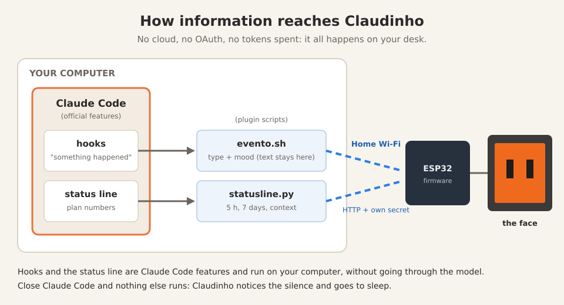
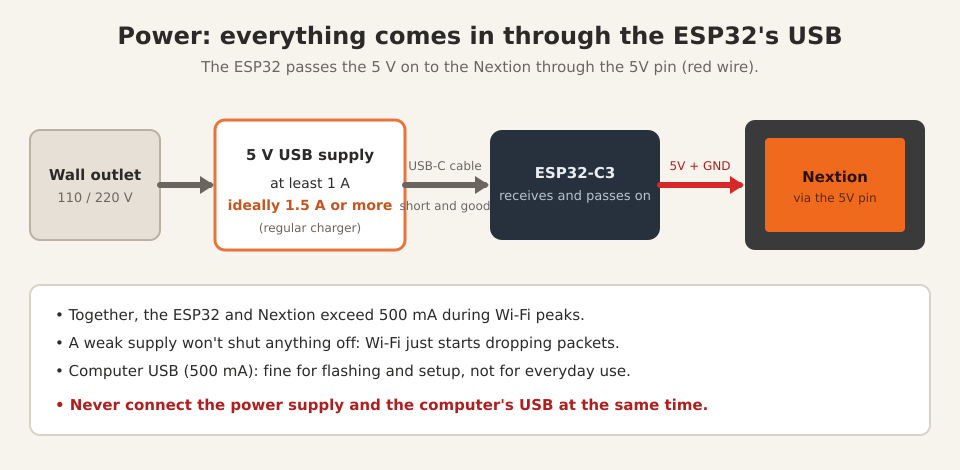
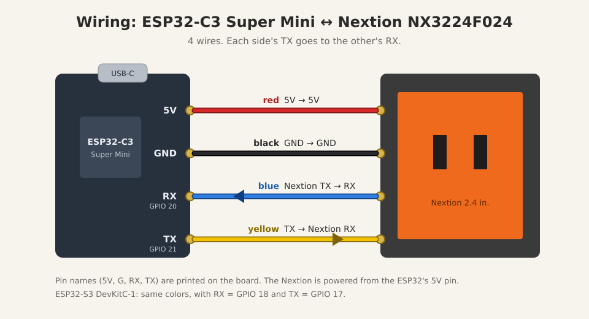

# Claudinho

**English** · [Português](README.pt-BR.md)

Claude Code's mascot, alive, on your desk.

The 3D-printable case is on MakerWorld: [https://makerworld.com/models/3365275-claudinho](https://makerworld.com/models/3365275-claudinho)

Already built one? The [user manual](docs/manual.md) covers faces, touch, colors and updates.

Claudinho is a Claude Code plugin that gives Clawd a body: an ESP32 with a
Nextion display that reacts to what Claude is doing (thinking, using a tool,
waiting for you, done, error) and shows how much of your plan you've used in
the 5-hour and 7-day windows.

- **No server, no cloud.** Your computer talks straight to the board over
  your local network. (The board only leaves your network to set its clock,
  on a public time server, NTP.)
- **No Anthropic credentials.** Nothing Claudinho uses day to day needs a
  login, token or key from your account, and none is ever sent to the board:
  the numbers come from Claude Code's own status line.
- **Spends no tokens and doesn't slow Claude down.** Hooks and the status
  line run in the background, without going through the model, and only send
  a short note over the network. (The guided setup, on the other hand, is a
  conversation with Claude and uses tokens like any other.)
- **Guided setup.** A skill flashes the firmware, sets up Wi-Fi and the
  screen, and tests everything. You just plug in the cable.

## Why

**How it started.** The daydream started small: a display showing token
usage, nothing more. From there, my urge to build something useless started
to boil. Why not animations? I went looking for a way to know what Claude was
doing without calling any API, and was surprised by how much Claude Code
already gives you. Then it hit me: if what I'm showing is, in a way, Claude
Code's mood, why not turn it into a little character? Add a 3D printer at
home and a roll of orange filament that was just sitting there... and here we
are.

And the name? In Brazil, calling Claude "Cláudio" is nothing original. Still,
for a little figure on the desk, "Claudinho" (little Claudio) came out
naturally, or, in English, Little Claude. And so Claudinho was born.

Along the way, two of my pet peeves became the project's rules.

**The first was OAuth.** I couldn't accept that an object made basically for
fun and decoration should get OAuth access to my account, whether stored on
the device itself or in a third-party API. To be clear: this is not a
criticism of other projects, just my own discomfort. It's what pushed me to
figure out how to make this work without it. The answer was to use what
Claude Code already hands you on your computer (hooks and the status line)
and send it straight to the board, over the local network, with no
credentials at all.

**The second was cost.** Spending tokens was not an option. Nor did it make
sense to keep Claude busy, or burning energy, just to feed information to a
desk ornament. That's why Claudinho costs zero tokens: hooks run in the
background without going through the model, and the plan numbers come from
the status line, which Claude Code computes anyway.

**What about the hardware?** It's what I had at home. The Nextion display
was left over from another project. The ESP32-C3 Super Mini wasn't even the
board I started with: I remembered I had one lying in the junk drawer and
thought "why not?". There are plenty of alternatives, and maybe someday
there'll be a version with more interesting or cheaper hardware.

The version I'm publishing is powered straight from the wall, through a USB
power supply. I'm waiting for a battery and a few other parts to build a
completely wireless version. Not because it's needed, just because it's cool.

## How it works

### Where the information comes from (and why it's free)

The trick is that I don't fetch anything. No API calls, no polling, no cron,
no program hiding in the background. Claude Code itself delivers everything,
through two doors it already leaves open for anyone to use.

**Hooks.** Claude Code tells you when things happen: a session started, you
sent a prompt, it's about to use a tool, a tool failed, it finished
responding, it's waiting for your permission, it's about to compact the
context, the session ended. At each of those moments it runs a command you
register. The plugin registers a tiny script that sends a short note to the
board, like "started using a tool", and that's it. It's a terminal command,
it doesn't go through the model, so it spends no tokens. And it runs in the
background: Claude doesn't even wait for it.

**The status line.** That info line at the bottom of Claude Code. Every
time it refreshes (after each response and, with the plugin, every 60
seconds too), Claude Code runs a command and hands it a package with the
model in use, how much of the context is used, and how much of your plan's
5-hour and 7-day windows has been consumed, with when each one resets.
Claude Code has those numbers anyway, because they come with the responses
it receives. The script just picks them up, sends them to the board and
draws the line as usual.

**Why it stays active without cron.** Because Claude Code itself triggers
everything, the moment things happen. While it's open, the notes arrive on
their own. When you close it, nothing else runs on the computer: Claudinho
notices the silence and goes to sleep. No process is left running and
waiting.

**And the mood?** When you send a prompt, the script takes a quick look at
the text, right there on your computer, searching for a few words: a
"thanks", an "error", a swear word. The text never leaves your computer; only
the mood label goes to the board ("happy", "worried", "startled").
(The word list is in Portuguese and English.)



| When Claude Code...                 | Claudinho...                            |
|-------------------------------------|-----------------------------------------|
| starts a session                    | wakes up happy                          |
| gets your prompt                    | thinks (and reacts to your mood: thanks, scolding, "it broke") |
| uses a tool                         | works (and gets suspicious after 5 in a row) |
| has a tool fail                     | gets angry for a moment                 |
| needs you (permission, question)    | waits, looking at you                   |
| finishes responding                 | shows it's done                         |
| compacts the context                | gets dizzy                              |
| has no open session                 | sleeps (and dims the screen)            |

When idle, between events, the face reflects the 5-hour window usage: normal
below 75%, tired from 75%, sweating from 90%. When usage crosses 50%, 75% or
90%, or grows noticeably after a response, it briefly shows the usage card
on its own (blinking red above 90%).

**Face color:** ask Claude to "change Claudinho's color" (or run
`claudinho.sh cor`) and pick it on the screen itself: 6 base colors, then 12
shades of the chosen one around the edges (with the screen mounted, they sit
right against the printed frame, so you compare them directly with the
filament), the tapped shade shown large in the middle, and a face preview with
Save, Back or Cancel. The eyes always stay black. See the [manual](docs/manual.md).

Tap the screen to see the 5-hour and 7-day windows, when each one resets,
how many terminals are open and the board's IP; after 15 s it goes back to
the face. A long press toggles brightness between 100% and 15%.

Your prompt text never leaves the PC: it's only used there, locally, to pick
the mood.

## Before you build, understand what you're installing

I don't like installing things I don't understand, and I imagine you don't
either. So, before you start soldering wires, it's worth separating what
comes out of the box with Claude Code from what we invented.

**What belongs to Claude Code (we invented none of this):**

- **Hooks.** An official feature: "when this happens, run this command".
  The moments are defined by Anthropic: session started, you sent a prompt,
  about to use a tool, a tool failed, finished responding, needs you, about
  to compact, session ended. The command is run by the Claude Code program,
  on your computer, like any terminal command. The AI doesn't even know.
- **Status line.** Also official: the footer line. Claude Code runs a
  command of yours on every refresh and serves the plan numbers on a platter.
- **Plugins and skills.** The package format that bundles hooks, scripts
  and "instruction manuals" (skills) that Claude reads when you ask for
  something. The setup skill is the only part of the project that talks to
  the model, and therefore the only part that spends tokens. Once, during
  installation.

**What's ours (blame us):**

- `evento.sh`, the script every hook calls. It reads the event, guesses your
  mood from the prompt (right there, on your computer) and sends a short note
  to the board.
- `statusline.py`, the status line script. It grabs the numbers, sends them
  to the board and draws the footer as before, so you won't even notice it's
  there.
- The ESP32 firmware: a tiny web server that receives the notes, draws the
  faces and animations, and shows the usage.
- The Nextion screen, the `configurar` skill, the flashing scripts and the
  security bits (its own secret, touch-to-update).

**Where everything lives:**

- **On your computer:** the plugin (inside `~/.claude/plugins/`), the
  configuration with the board's IP and secret (in
  `~/.claude/plugins/data/claudinho-claudinho/`) and the status line hookup
  (in your `~/.claude/settings.json`, with a backup).
- **On the board:** the firmware, the Wi-Fi password and the secret.
- **In the cloud:** nothing. Sorry, no monthly subscription.

**The journey of a "thanks":**

1. You type "thanks" and hit Enter.
2. Claude Code fires the prompt hook, which runs `evento.sh`.
3. The script sees the "thanks" and decides the mood is "happy". The text
   stays right there.
4. Only this goes to the board, over your home network:
   `{"tipo":"prompt","humor":"feliz"}`.
5. The ESP32 gets it and Claudinho looks like someone who just got a
   compliment.

Meanwhile, after each response, the status line delivers the numbers and
`statusline.py` passes along just the numbers. Close Claude Code and that's
the end of it: nothing keeps running, and Claudinho falls asleep out of
boredom.

## Warning: at your own risk

Soldering irons, power supplies and computer USB ports: a lot can go wrong,
and you might end up with a fried ESP32, a fried Nextion or, worse, a fried
USB port on your computer. (During development, a test board got hot enough
to burn my finger. Nothing educational about it, it just hurt.)

So if you don't know what you're doing, stop, study a bit or ask someone who
does, and don't come blaming Claudinho or Argeu afterwards. The license (MIT)
already says this in a more boring way: the project comes "as is", without
warranty of any kind.

For the record: my high school degree is in electronics technology, and I
hold a master's and a PhD in *gambiarra* (Brazilian for "jury-rigging"). Or
rather: in low-cost, high-risk alternative technical solutions.

## Parts

| Part | Notes |
|---|---|
| ESP32-C3 Super Mini | tested; the ESP32-S3 DevKitC-1 is also supported (not tested on real hardware) |
| Nextion Discovery NX3224F024 (2.4", 320×240) | the included screen is for this model |
| 4 wires | 5V, GND, TX, RX |
| USB **data** cable | only for the first flash |
| 5 V USB power supply, **at least 1 A** | see below |
| 3D-printed case | [on MakerWorld](https://makerworld.com/models/3365275-claudinho) (PLA, no supports) |

### Power



Everything comes in through the ESP32's USB port: it takes the 5 V and passes
it on to the Nextion through the 5V pin. So the power supply has to handle
both together.

| | |
|---|---|
| Voltage | 5 V (any regular USB charger) |
| Minimum current | **1 A** |
| Recommended | **1.5 A or more** (what I use) |
| Cable | short and good quality: a thin, long cable also drops the voltage |

Together, the ESP32 and the Nextion go above 500 mA during Wi-Fi peaks. With
a weak power supply everything seems to work, but Wi-Fi drops packets and
over-the-network updates fail. A computer USB port (500 mA on USB 2.0) is
fine for flashing and setup, but not ideal for everyday use. And never
connect the power supply and the computer's USB at the same time.

### Wiring



| Nextion wire | ESP32-C3 Super Mini | ESP32-S3 DevKitC-1 |
|---|---|---|
| red 5V | 5V | 5V |
| black GND | GND | GND |
| blue TX | RX pin (GPIO 20) | GPIO 18 |
| yellow RX | TX pin (GPIO 21) | GPIO 17 |

The screen is mounted rotated 270°: the Nextion's visible area isn't centered
on its board, and only in this position does it end up centered in the case.

## Installation

1. Create a folder for the project and open Claude Code in it:

   ```bash
   mkdir ~/LittleClaude && cd ~/LittleClaude && claude
   ```

2. Add the marketplace and install the plugin (inside Claude Code):

   ```
   /plugin marketplace add argeuthiesen/claudinho
   /plugin install claudinho@claudinho
   ```

3. Plug the ESP32 into your computer with the data cable and ask:

   ```
   /claudinho:configurar
   ```

   (The skill name is Portuguese for "configure"; Claude will talk to you in
   your own language.) The skill finds the board, flashes the firmware
   (~30 s), lists the Wi-Fi networks the board can see and asks you to run a
   command in a terminal, where you type the Wi-Fi password hidden: it never
   goes through the conversation with Claude and is stored **only on the
   board**. Then it flashes the Nextion screen over the network (~40 s,
   asking for a tap on the screen), enables the status line and runs a test.

4. Write down the IP and MAC the skill shows you and reserve that IP on your
   router (static DHCP). If the IP changes, run the skill again.

After the first flash you no longer need the cable: the board can stay on
the power supply.

### Status line

Plugins can't enable the status line on their own; the skill does it for
you, backing up `~/.claude/settings.json`. If you already had a status line,
it's still the one you see: Claudinho just reads the numbers and passes them
along. To undo:

```bash
python3 <plugin>/scripts/instalar-statusline.py <plugin-data> --remover
```

## Updates

After the first time, everything goes over the network, no cable needed:

```bash
scripts/claudinho.sh atualizar   # firmware (~40 s)
scripts/claudinho.sh tela        # Nextion screen
```

Both ask for **a tap on Claudinho's screen** (or the board's BOOT button)
before sending anything: the screen shows a "tap to allow" message and waits
1 minute. Without someone in front of it, nobody swaps the firmware, not even
someone who sniffed the secret on your network.

It's safe: the ESP32 writes the new firmware to a spare partition and only
switches if everything arrived intact. If the network drops halfway, it
keeps running the current firmware and you just try again. If the screen
upload is interrupted, the Nextion may show "System Data Error": run the
command again, nothing breaks.

Or just ask Claude: "update Claudinho".

## Commands

The commands are in Portuguese (sorry, it's a Brazilian project):

```
scripts/claudinho.sh info                 # status and plan numbers
scripts/claudinho.sh log                  # board log (no cable needed)
scripts/claudinho.sh cara <type> [mood]   # test a face ("cara" = face)
scripts/claudinho.sh cor                  # pick the face color on screen ("cor" = color)
scripts/claudinho.sh cor R G B [salvar]   # exact color ("salvar" = save it on the board)
scripts/claudinho.sh reiniciar            # restart
scripts/claudinho.sh consumo [seconds]    # show usage now
scripts/claudinho.sh atualizar [file.bin] # update firmware
scripts/claudinho.sh tela [file.tft]      # update the screen
scripts/wifi.sh PORT "NETWORK"            # change Wi-Fi over USB (hidden password)
```

Face types: `inicio` (start), `prompt`, `ferramenta` (tool), `erro` (error),
`parou` (done), `atencao` (attention), `compact`, `fim` (end), `dormir`
(sleep). Mood (with `prompt`): `feliz` (happy), `preocupado` (worried),
`susto` (startled).

## Security

Claudinho has its own secret, generated during setup, that the PC uses to
talk to the board. It **only controls the toy**: it gives no access at all to
your Anthropic account.

- **What goes over the network:** the event type (tool, done...), the mood
  (happy, worried, startled), a short session code and the plan numbers. Your
  prompt text never leaves the computer.
- **No encryption on the local network.** It's plain HTTP, like most home
  gadgets. Someone able to spy on your network could discover the secret and
  mess with Claudinho (change the face, restart it), but **not swap the
  firmware**: that requires a tap on the screen. Reading the status
  (`/mini.json`) and the log also requires the secret.
- **USB means full control.** Anyone who plugs a cable into the board can
  reconfigure it and read its memory, where the Wi-Fi password and the secret
  live. Before giving the board away or throwing it out, wipe it with the
  board on USB: `scripts/esptool.sh --port PORT erase-flash`.
- **On a shared network** (office, coworking), prefer a devices-only network
  if there is one.

## Tested environments

**Tested end to end:** WSL2 on Windows 11, ESP32-C3 Super Mini, Nextion
NX3224F024_011.

**Written to work, not yet tested on real hardware:** native Linux, macOS,
Windows with Git Bash, ESP32-S3 DevKitC-1.

If you use one of these, tell us how it went (open an issue), even if it
worked on the first try: that's how it gets onto the tested list.

## Good to know

Things we learned along the way (some the hard way):

- **Uninstalling the plugin deletes its configuration** (IP and secret).
  After reinstalling, run `/claudinho:configurar` again; the board doesn't
  need to be reflashed, just reconfigured.
- **Installed or updated the plugin? Restart Claude Code.** New hooks only
  take effect after that (`/exit` and then `claude --continue` brings you
  back to the same conversation).
- **Plan numbers only show up after Claude's first response** in a session:
  that's when the status line receives the data. After that they refresh on
  every response and every 60 seconds.
- **It falls asleep on its own** when all sessions close or after 3 minutes
  without news from the computer, and dims the screen.
- **Reserve the IP on your router** (static DHCP using the MAC shown during
  setup). If the IP changes, it stops reacting until you run the skill again.
- **2.4 GHz Wi-Fi only.** The ESP32 can't see 5 GHz networks.
- **Networks with several access points** (mesh, repeaters) under the same
  name: Claudinho joins the one with the strongest signal, which isn't always
  the best one. If updates fail often, that's probably why; nothing breaks,
  just try again. `claudinho.sh log` shows which access point it joined and
  with what signal.
- **Updating firmware or screen needs a tap on the screen** (or the BOOT
  button) within 1 minute. After the tap, uploads are allowed for 2 minutes.
- **The log lives in the board's memory:** restart it and it starts over.
  Check the log before restarting if you're investigating something.
- **Opening the serial port restarts the ESP32-C3.** That's normal; the
  scripts account for it.
- **The screen only works rotated 270°** (that's how the case was designed)
  and only on the Nextion NX3224F024; other models need another screen
  compiled in the Nextion Editor (the `.HMI` project is in `nextion/`).
- **The first flash is always over USB.** After that, everything goes over
  the network.
- **Before giving the board away or throwing it out, wipe its memory** (see
  Security): the Wi-Fi password is stored on it.

## Troubleshooting

| Symptom | What to do |
|---|---|
| The board doesn't show up on USB | Change the cable (many are charge-only). Hold BOOT while plugging it in. |
| `PRECISA_BOOT` while flashing | Hold BOOT, unplug and replug the USB, release BOOT, run it again. |
| Won't join Wi-Fi | 2.4 GHz networks only. Check the password by running the skill again. |
| Stopped reacting | The IP changed: run `/claudinho:configurar` (reserve the IP on your router). |
| `atualizar` or `tela` fail halfway | Wi-Fi dropping packets. Nothing breaks: try again. If it keeps happening, `claudinho.sh reiniciar` and try again; check the power supply (1 A or more). |
| Garbled or blank screen | Run `claudinho.sh tela` again, then `claudinho.sh reiniciar`. |

For diagnosis without a cable, `claudinho.sh log` shows what the board has
logged since it started.

## For those who want to hack on it

- `firmware/claudinho/`: the firmware (Arduino, ESP32 core 3.x, ArduinoJson 7).
  `firmware/compilar.sh` builds the C3 and S3 `.bin` files into `firmware/bin/`.
- `nextion/`: the compiled screen for the NX3224F024, plus the `.HMI` project.
- `scripts/`: flashing, serial, hooks, status line and `claudinho.sh`.
- `skills/configurar/`: the skill that runs the setup.
- `hooks/hooks.json`: the Claude Code events Claudinho listens to.
- Versions: the plugin (`.claude-plugin/plugin.json`) and the firmware
  (`firmware/claudinho/config.h`) move together when possible, but are
  counted separately: `claudinho.sh info` shows the firmware version on the
  board.
- The scripts find the plugin's data folder on their own
  (`~/.claude/plugins/data/claudinho-claudinho`); to use another one, set
  `CLAUDINHO_DADOS`.
- Code, comments and messages are in Portuguese. Pull requests in English
  are welcome.

## Authorship

The case's 3D model was not made by AI: it's 100% mine, modeled by hand in
SketchUp (and it's on [MakerWorld](https://makerworld.com/models/3365275-claudinho)).

On the software side, the concepts came from me. The heavy lifting
(firmware, scripts, skill, tests and a good part of this text) was done by
Claude, working with me inside Claude Code itself. So authorship is shared.
If Skynet really happens, I don't want anyone holding a grudge because I
took sole credit for something built with four hands. ;)

And, as a bonus, we also brought in Codex (GPT) to review the project's
security. That makes two AIs on my side when the machines rise.

Claude Code, Clawd and the Claude brand belong to Anthropic. This is a fan
project with no official affiliation with Anthropic.
