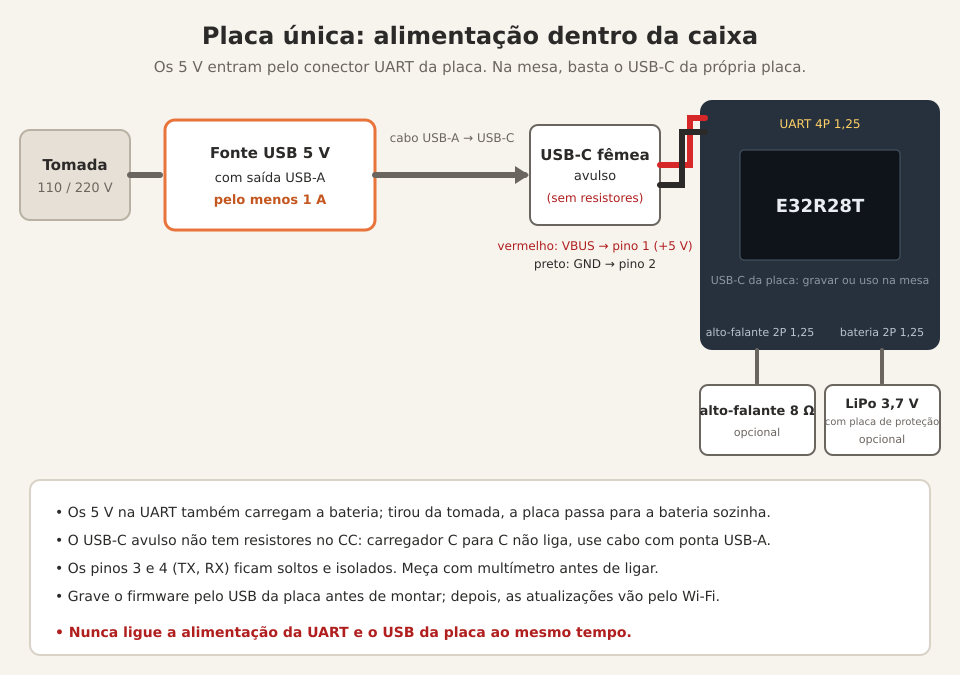
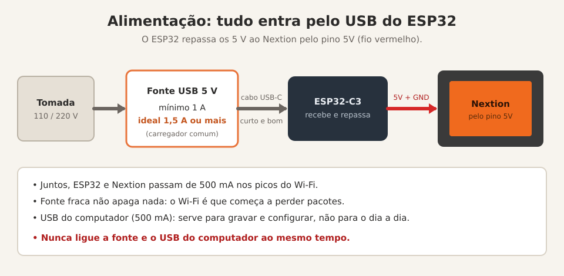
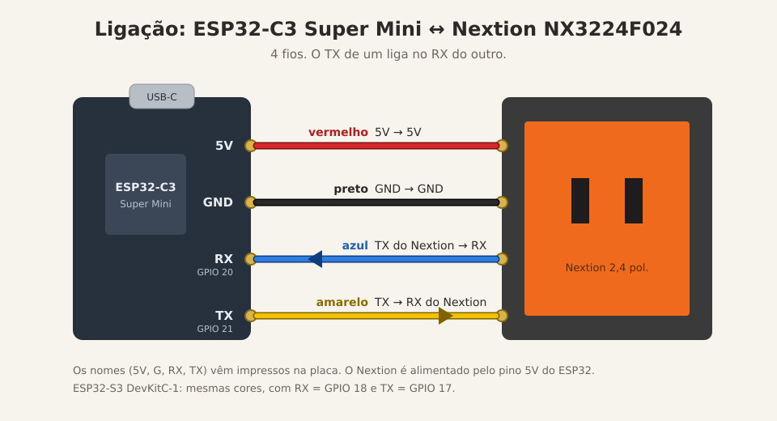
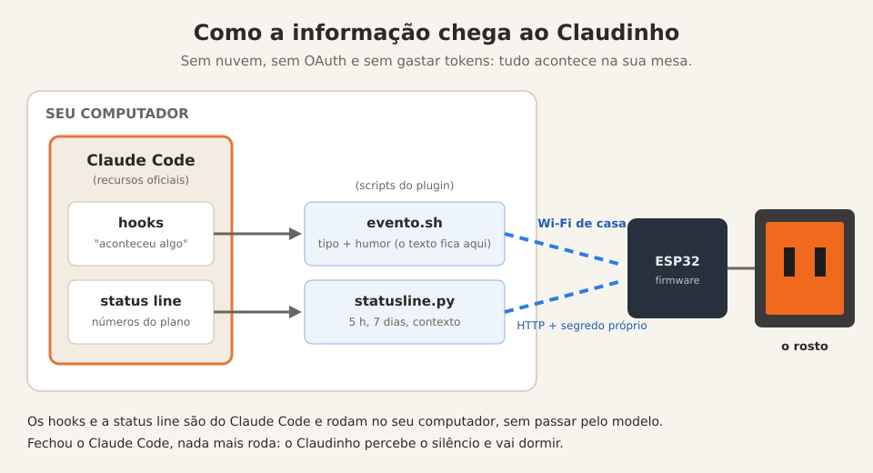

# Claudinho

[English](README.md) · **Português**

O mascote do Claude Code, vivo, na sua mesa.

https://github.com/user-attachments/assets/599573a4-2537-459c-81e3-0e593c2b9ad6

*O vídeo mostra a versão clássica (ESP32-C3 + Nextion).*

Claudinho é um plugin do Claude Code que dá corpo ao Clawd: um ESP32 com tela
de toque (a placa única E32R28T, recomendada, ou o clássico ESP32-C3 + Nextion)
que reage ao que o Claude está fazendo (pensando, usando uma
ferramenta, esperando você, terminou, deu erro) e mostra quanto do seu plano
já foi usado nas janelas de 5 horas e de 7 dias.

- **Sem servidor externo e sem serviço de nuvem.** O PC fala direto com a
  placa, na sua rede local. (A placa só sai da rede para acertar o relógio,
  num servidor público de hora, o NTP.)
- **Sem credencial da Anthropic.** Nada do que o Claudinho usa no dia a dia
  precisa de login, token ou chave da sua conta, e nenhum é enviado à placa:
  os números vêm da própria status line do Claude Code.
- **Não gasta tokens nem atrasa o Claude.** O Claude Code já oferece dois
  jeitos oficiais de acompanhar o que ele está fazendo: os *hooks* (ele roda
  um comando quando algo acontece) e a *status line* (ele entrega a um
  comando os números do seu plano). Os dois rodam em segundo plano, sem
  passar pelo modelo, e o Claudinho só os usa para mandar um aviso curto pela
  rede. (Conversar com o Claude sobre o Claudinho, como na configuração
  guiada, é uma conversa como qualquer outra e usa tokens.) Detalhes em
  [Como funciona](#como-funciona).
- **Configuração guiada.** Uma skill grava o firmware, configura o Wi-Fi e a
  tela, e testa tudo. Você só pluga o cabo.
- **Voz e bateria (placa única).** Na E32R28T, o Claudinho fala um idioma de
  robô, de bipes, por um alto-falante pequeno, e funciona com uma bateria que
  a própria placa carrega.
- **Opcional: sua impressora Bambu Lab.** O Claudinho também conecta direto
  numa impressora 3D Bambu da sua rede e mostra um painel da impressão e
  alertas (começou, pausou e por quê, terminou, falhou...) que ficam até você
  tocar. Testado na P2S. Veja o [manual](docs/manual.pt-BR.md#impressora-bambu-lab-opcional).

**[Hardware](#qual-versão) · [Instalação](#instalação) · [Manual de uso](docs/manual.pt-BR.md)**

## Qual versão?

O Claudinho roda em dois tipos de hardware. Para montar um novo, vá de
**placa única (E32R28T)**.

| | [Placa única: E32R28T](#placa-única-recomendada-e32r28t) | [Clássica: ESP32-C3 + Nextion](#versão-clássica-esp32-c3--nextion) |
|---|---|---|
| Situação | **recomendada** para montar um novo | totalmente suportada (é a do vídeo) |
| Hardware | uma placa só: ESP32 com tela de toque de 2,8" embutida | ESP32-C3 Super Mini + display Nextion de 2,4" |
| Solda | nenhuma | 4 fios |
| Voz e bateria | alto-falante e bateria opcionais (carregador na placa) | não (alimentada por fonte USB) |
| Atualizar a tela | faz parte do firmware | arquivo de tela do Nextion separado (`.tft`) |
| Caixa impressa em 3D | sendo modelada agora, sai no MakerWorld em breve | [no MakerWorld](https://makerworld.com/models/3365275-claudinho) |

## Placa única (recomendada): E32R28T

<p>
  
  
</p>

A **E32R28T** ("2.8inch ESP32-32E Display", da LCDWiki) é um ESP32 com tela
de toque de 2,8" embutida, 320×240. Ela simplifica bastante:

- **Uma placa em vez de duas.** Sem fios para soldar, sem alimentação
  separada para a tela: plugou o USB, pronto.
- **Sem Nextion Editor e sem `.tft`.** O próprio ESP32 desenha a tela, com as
  fontes dentro do firmware (texto mais suave, sem serrilhado). A
  configuração tem uma etapa a menos, e atualizar é só gravar o firmware.
- **Bateria com carregador na placa**, para um Claudinho portátil de verdade:
  um ícone de bateria no cartão de consumo mostra quanto resta, e o
  `claudinho.sh desligar` põe a placa em sono profundo (aperte BOOT para
  ligar), para a bateria não secar enquanto ela fica guardada.
- **Ele fala.** Com um alto-falante pequeno no conector da placa, o Claudinho
  fala um idioma de robô, de bipes e assobios. Nada é gravado: cada fala é
  gerada na hora, então nenhuma sai igual, e o humor muda a entonação (feliz
  ao acordar, uma pergunta quando o Claude precisa de você, bravo num erro, um
  "pronto!" rápido quando o Claude termina, sonolento na hora de dormir).

Tudo funciona nela (caras, consumo, cenas, impressora, jogos, modo
demonstração, idiomas), e a skill de configuração reconhece a placa sozinha.

### Peças

| Peça | Observações |
|---|---|
| [Placa E32R28T (ESP32 + tela de toque de 2,8")](https://www.aliexpress.com/item/1005009659317465.html) | a versão com toque resistivo; o anúncio pode chamar de "ESP32-32E 2.8"<br> |
| [Alto-falante de 8 Ω com plugue JST 1,25](https://www.aliexpress.com/item/1005009194531045.html) | opcional, para a voz; o pequeno 2415 (24 × 15 mm) encaixa bem<br> |
| Bateria LiPo de 3,7 V com plugue **JST 1,25 mm de 2 pinos** e placa de proteção | opcional. A das fotos é uma 103450 (10 × 34 × 51 mm, 2000 mAh): <br> <br>Outras capacidades servem, mas o tamanho muda: confira se cabe na caixa. Cuidado com anúncios do plugue maior, de 2,54 mm. **Confira a polaridade** antes de ligar (bateria barata às vezes vem invertida). |
| Cabo USB-C de dados | para configurar, gravar e carregar |
| Fonte USB 5 V com saída USB-A, **pelo menos 1 A** | para o dia a dia (um carregador de celular comum); na montagem na caixa, com cabo USB-A para USB-C |
| Conector USB-C fêmea avulso (placa simples, com VBUS e GND) | para a montagem na caixa: é a entrada de energia da caixa (veja [Alimentação](#alimentação)) |
| Cabo de 4 pinos, 1,25 mm | para a montagem na caixa; vem com a placa |

### Alimentação

- **Na mesa (placa sem caixa):** só o cabo USB-C. Nada de solda.
- **Dentro da caixa do Claudinho:** a placa é alimentada com **5 V** pelo
  conector UART dela (o de 4 pinos, passo 1,25 mm, muitas vezes vendido como
  "MX1.25"): pino 1 é +5 V e pino 2 é GND no esquema da placa. O cabo de 4
  pinos que vem com a placa vai desse conector até um conector USB-C fêmea
  avulso na caixa (VBUS no +5 V, GND no GND).
- **Qual carregador usar na caixa:** esses conectores avulsos normalmente não
  têm os resistores de CC (5,1 kΩ), então um carregador USB-C para USB-C não
  entrega energia para eles. Use cabo e carregador **USB-A para USB-C**.
- **Bateria:** os 5 V nesse pino também carregam a bateria (o carregador
  TP4054 da placa é alimentado pela mesma linha de +5 V). Desligou da
  tomada, a placa passa para a bateria sozinha.



> [!WARNING]
> **Grave antes de montar.** Antes de colocar qualquer coisa na caixa, grave
> o firmware base pela USB (a skill de configuração faz isso). Depois, as
> atualizações vão pelo Wi-Fi, e a porta USB não é mais necessária.
>
> **Alimentação: uma fonte só.** Confira a marcação na placa e meça com
> multímetro antes de ligar qualquer coisa no conector UART. **Nunca** ligue
> essa alimentação externa e o cabo USB da placa ao mesmo tempo: duas fontes
> brigando podem danificar a placa ou a porta USB do seu computador.

### Avisos

- **Driver USB no Windows.** O chip USB da placa é um CH340. Se a porta não
  aparecer no Windows, instale o driver do CH340.
- **Abrir a porta USB reinicia a placa.** É assim que ela grava sem apertar
  botão. A tela pode piscar: é normal.
- **ILI9341 ou ST7789?** A ficha da placa diz ILI9341, mas a tela é uma
  ST7789. O firmware já sabe disso.
- **Caixa:** a caixa dela está sendo modelada agora e sai no MakerWorld em
  breve. Por enquanto, é para quem não se importa com a placa sem caixa.

## Aviso: por sua conta e risco

Ferro de solda, fontes de alimentação e portas USB de computador: tem muita
coisa que pode dar errado, e o resultado pode ser uma placa queimada, uma
tela queimada ou, pior, uma porta USB do seu computador queimada. (Durante
o desenvolvimento, uma plaquinha de teste esquentou a ponto de queimar o meu
dedo. Não foi nada instrutivo, só doeu.)

Então, se você não sabe o que está fazendo, pare, estude um pouco ou peça
ajuda a alguém que saiba, e não venha depois culpar o Claudinho ou o Argeu.
A licença (MIT) já diz isso de um jeito mais chato: o projeto vem "como
está", sem garantia de nenhum tipo.

Para constar: minha formação de ensino médio é técnico em eletrônica, e
tenho mestrado e doutorado em gambiarra. Ou melhor: em soluções técnicas
alternativas de baixo custo e alto risco.

## Pré-requisitos

- **Claude Code**, num sistema da lista de
  [Ambientes testados](#ambientes-testados): testado de ponta a ponta no WSL2
  do Windows 11; escrito para funcionar (ainda sem teste real) em Linux
  nativo, macOS e Windows com Git Bash. Os scripts usam `bash`, `curl` e
  `python3`.
- **A placa** ([E32R28T](#placa-única-recomendada-e32r28t) ou
  [clássica](#versão-clássica-esp32-c3--nextion)) e um **cabo USB de dados**
  (muitos cabos são só de carga).
- **Uma rede Wi-Fi de 2,4 GHz.** O ESP32 não enxerga redes de 5 GHz.

## Instalação

1. Crie uma pasta para o projeto e abra o Claude Code nela:

   ```bash
   mkdir ~/LittleClaude && cd ~/LittleClaude && claude
   ```

2. Adicione o marketplace e instale o plugin (dentro do Claude Code):

   ```
   /plugin marketplace add argeuthiesen/claudinho
   /plugin install claudinho@claudinho
   ```

3. **Reinicie o Claude Code.** Os hooks do plugin só valem depois disso
   (`/exit` e `claude --continue` volta na mesma conversa). Faça o mesmo
   sempre que atualizar o plugin.

4. **Só na versão clássica:** ligue antes o ESP32 ao Nextion (4 fios, veja
   [Ligação](#ligação)). A placa única não precisa de nada.

   Ligue a placa no computador com o cabo de dados e peça:

   ```
   /claudinho:configurar
   ```

   A skill acha a placa, descobre sozinha qual é a versão (placa única ou
   clássica), grava o firmware (~30 s), lista as redes Wi-Fi que a placa
   enxerga (só 2,4 GHz) e pede para você rodar um comando num terminal, onde
   você digita a senha do Wi-Fi sem que ela apareça na tela: ela não passa
   pela conversa com o Claude e fica gravada **só na placa**. Na versão
   clássica, depois grava a tela do Nextion pela rede (~40 s, pedindo um
   toque na tela). Na placa única não há fios para conferir nem etapa do
   Nextion. Por fim, liga a status line e faz um teste.

5. Anote o IP e o MAC que a skill mostrar e reserve esse IP no roteador
   (DHCP estático). Se o IP mudar, rode a skill de novo.

6. **Os números do plano aparecem depois da primeira resposta** do Claude
   numa sessão: é quando a status line recebe os dados. Até lá, as caras já
   reagem.

Depois da primeira gravação, o cabo não é mais necessário: a placa pode
ficar na fonte (ou na bateria, na placa única).

### Status line

Plugins não podem ligar a status line sozinhos; a skill faz isso por você,
com backup do `~/.claude/settings.json`. Se você já tinha uma status line,
ela continua sendo a que aparece: o Claudinho só lê os números e a repassa.
Para desfazer, peça ao Claude ou rode (o que é `<plugin>` está em
[onde rodar os comandos](#onde-rodar-os-comandos)):

```bash
python3 <plugin>/scripts/instalar-statusline.py ~/.claude/plugins/data/claudinho-claudinho --remover
```

## No dia a dia

Depois de configurado, não há nada a fazer: o Claudinho reage sozinho
enquanto o Claude Code está aberto e vai dormir quando ele fecha. Tocando na
tela, aparecem as janelas de 5 h e 7 dias, com o horário em que cada uma
renova, quantos terminais estão abertos e o IP da placa; toque longo alterna
o brilho. As caras, os toques, as cores, os dois joguinhos, o painel da
impressora e o resto estão no [manual de uso](docs/manual.pt-BR.md).

**É só pedir ao Claude.** Não precisa decorar comando. Dentro do Claude
Code, peça do seu jeito, por exemplo:

- "atualiza o Claudinho"
- "muda a cor do Claudinho" (você escolhe na própria tela)
- "o Claudinho parou de reagir" (a skill faz um diagnóstico)
- "troquei o Wi-Fi, reconfigura o Claudinho"
- "roda a demonstração do Claudinho"

### Onde rodar os comandos

Se preferir o terminal, tudo passa pelo `claudinho.sh`, um script dentro da
pasta do plugin. Depois de instalar pelo marketplace, os caminhos são:

- **`<plugin>`** (o plugin em si, com os scripts):
  `~/.claude/plugins/cache/claudinho/claudinho/<versão>/`, por exemplo
  `.../claudinho/1.13.0/`. Se houver mais de uma pasta de versão, use a mais
  nova. (Se você clonou este repositório, `<plugin>` é a raiz dele.)
- **`<dados-do-plugin>`** (o IP e o segredo da placa):
  `~/.claude/plugins/data/claudinho-claudinho/`. Os scripts acham essa pasta
  sozinhos.

A skill acha as duas por conta própria (o Claude Code entrega a ela
`${CLAUDE_PLUGIN_ROOT}` e `${CLAUDE_PLUGIN_DATA}`). Neste README,
`claudinho.sh` é abreviação de `bash <plugin>/scripts/claudinho.sh`. Os
comandos mais úteis:

```
claudinho.sh info         # estado e números do plano
claudinho.sh log          # log da placa (sem cabo)
claudinho.sh cor          # escolhe a cor do rosto na tela
claudinho.sh atualizar    # atualiza o firmware
claudinho.sh reiniciar    # reinicia
claudinho.sh desligar     # placa única: sono profundo, para poupar a bateria (o BOOT acorda)
```

### Comandos

<details>
<summary>Lista completa de comandos</summary>

```
claudinho.sh info                 # estado e números do plano
claudinho.sh log                  # log da placa (sem cabo)
claudinho.sh cara <tipo> [humor]  # testa uma cara
claudinho.sh cor                  # escolhe a cor do rosto na tela
claudinho.sh cor R G B [salvar]   # cor exata (com "salvar", fica gravada)
claudinho.sh reiniciar            # reinicia
claudinho.sh consumo [segundos]   # mostra o consumo agora
claudinho.sh velha                # jogo da velha contra o Claudinho
claudinho.sh genius               # Genius: repita a sequência de cores
claudinho.sh bambu IP_IMPRESSORA  # liga uma impressora Bambu (pede o código de acesso, escondido)
claudinho.sh bambu desligar       # desliga e apaga o código da placa
claudinho.sh painel               # mostra o painel da impressora
claudinho.sh idioma [código]      # idioma da tela: en, pt-BR... (sem código: o atual e os disponíveis)
claudinho.sh demo [parar]         # modo demonstração: um passeio de ~2 min por tudo, para filmar
claudinho.sh som [humor|liga|desliga|volume N]  # placa única: ouve uma fala (feliz, pergunta, sono...), liga/desliga, volume
claudinho.sh desligar             # placa única: sono profundo, para poupar a bateria (o BOOT acorda)
claudinho.sh alerta [tipo]        # alerta de exemplo da impressora: bom, ruim, filamento, hms
claudinho.sh cena <tipo>          # mostra uma cena: codando, terminal, lendo, agente
claudinho.sh atualizar [arquivo.bin]  # atualiza o firmware
claudinho.sh tela [arquivo.tft]   # atualiza a tela do Nextion (versão clássica)
bash <plugin>/scripts/wifi.sh PORTA "REDE"   # troca o Wi-Fi pela USB (senha escondida)
```

Tipos de cara: `inicio`, `prompt`, `ferramenta`, `erro`, `parou`, `atencao`,
`compact`, `fim`, `dormir`. Humor (com `prompt`): `feliz`, `preocupado`, `susto`.

</details>

## Atualizações

O jeito fácil: peça ao Claude "atualiza o Claudinho". Depois da primeira
vez, tudo vai pela rede, sem cabo. Pelo terminal:

```bash
claudinho.sh atualizar   # firmware (~40 s)
claudinho.sh tela        # tela do Nextion (só versão clássica)
```

Na placa única, basta o `atualizar` para a placa: a tela faz parte do
firmware.

Os dois pedem **um toque na tela do Claudinho** (ou o botão BOOT da placa)
antes de enviar qualquer coisa: a tela mostra "Toque na tela para permitir"
e espera 1 minuto. Sem alguém na frente dele, ninguém troca o firmware, nem
quem descobrir o segredo pela rede.

É seguro: o ESP32 grava o firmware novo numa partição reserva e só troca se
tudo chegar inteiro. Se a rede cair no meio, ele continua no firmware atual
e basta repetir. Na versão clássica, se a gravação da tela for interrompida,
o Nextion pode mostrar "System Data Error": repita o comando, não estraga
nada.

**Atualizar o plugin** (os scripts, hooks e a skill no seu computador) é um
passo separado, no terminal:

```bash
claude plugin marketplace update claudinho && claude plugin update claudinho@claudinho
```

Depois, reinicie o Claude Code, para os hooks novos valerem. Uma versão nova
do plugin pode trazer firmware novo: rode `claudinho.sh atualizar` em seguida.

**Vindo da 1.5 ou anterior (versão clássica)?** O firmware 1.6 trouxe as
cenas, que usam uma fonte mono nova na tela do Nextion: rode também
`claudinho.sh tela` (mais um toque), senão o texto das cenas não aparece.

## Bom saber

Coisas que aprendemos no caminho (algumas do jeito difícil):

- **Desinstalar o plugin apaga a configuração** (IP e segredo). Depois de
  reinstalar, rode `/claudinho:configurar` de novo; a placa não precisa ser
  regravada, só reconfigurada.
- **Os números do plano atualizam** a cada resposta e a cada 60 segundos
  (depois da primeira resposta da sessão).
- **Ele dorme sozinho** quando todas as sessões fecham ou depois de 3 minutos
  sem notícia do computador, e baixa o brilho.
- **Reserve o IP no roteador** (DHCP estático pelo MAC que a configuração
  mostra). Se o IP mudar, ele para de reagir até você rodar a skill de novo.
- **Rede com vários pontos de acesso** (mesh, repetidor) com o mesmo nome: o
  Claudinho entra no de sinal mais forte, que nem sempre é o melhor. Se as
  atualizações falharem com frequência, é por aí; não estraga nada, repita.
  O `claudinho.sh log` mostra em que ponto ele entrou e com que sinal.
- **Atualizar o firmware (ou a tela do Nextion) pede um toque na tela** (ou o
  botão BOOT) em até 1 minuto. Depois do toque, o envio fica liberado por 2
  minutos.
- **O log fica na memória da placa:** reiniciou, recomeça do zero. Olhe o log
  antes de reiniciar, se estiver investigando algo.
- **Abrir a porta serial reinicia a placa** (ESP32-C3 e E32R28T; na placa
  única a tela pode piscar). Normal; os scripts já contam com isso.
- **Vai guardar por dias (placa única)?** Rode antes o `claudinho.sh
  desligar`, para a bateria não secar. O BOOT acorda.
- **A tela do Nextion só funciona girada 270° (versão clássica)** (é como a
  caixa foi pensada) e só no Nextion NX3224F024; outros modelos precisam de
  outra tela compilada no Nextion Editor (o projeto `.HMI` está em
  `nextion/`).
- **A primeira gravação é sempre pela USB.** Depois, tudo vai pela rede.
- **Antes de dar ou descartar a placa, apague a memória** (ver
  [Segurança](#segurança)): a senha do Wi-Fi fica gravada nela.

## Problemas comuns

| Sintoma | O que fazer |
|---|---|
| A placa não aparece no USB | Troque o cabo (muitos são só de carga). Segure BOOT enquanto pluga. Placa única no Windows: instale o driver do CH340. |
| `PRECISA_BOOT` na gravação | Segure BOOT, tire e ponha o USB, solte BOOT, rode de novo. |
| Não entra no Wi-Fi | Só redes de 2,4 GHz. Confira a senha rodando a skill de novo. |
| Parou de reagir | O IP mudou: rode `/claudinho:configurar` (reserve o IP no roteador). |
| Os números do plano não aparecem | Eles só aparecem depois da primeira resposta do Claude na sessão. Acabou de instalar ou atualizar o plugin? Reinicie o Claude Code. |
| `atualizar` ou `tela` falham no meio | Wi-Fi perdendo pacotes. Não estraga nada: repita. Se insistir, `claudinho.sh reiniciar` e tente de novo; na versão clássica, confira a fonte (1 A ou mais). |
| Tela com lixo ou branca (versão clássica) | `claudinho.sh tela` de novo, depois `claudinho.sh reiniciar`. |

Para diagnóstico sem cabo, `claudinho.sh log` mostra o que a placa registrou
desde que ligou (ou simplesmente diga ao Claude "o Claudinho parou de
reagir").

## Ambientes testados

**Testado de ponta a ponta:** WSL2 no Windows 11. Placa única: E32R28T (tela
ST7789), com alto-falante e bateria. Versão clássica: ESP32-C3 Super Mini com
Nextion NX3224F024_011. Módulo da impressora: Bambu Lab P2S com AMS.

**Escrito para funcionar, ainda sem teste real:** Linux nativo, macOS,
Windows com Git Bash, ESP32-S3 DevKitC-1, outras impressoras Bambu com acesso
local (X1, P1, A1).

Se você usar um desses, conte como foi (abra uma issue), mesmo que tenha
funcionado de primeira: é assim que ele entra na lista de testados.

## Versão clássica (ESP32-C3 + Nextion)

A primeira versão, a do vídeo e a da
[caixa que está no MakerWorld](https://makerworld.com/models/3365275-claudinho).
Ela continua totalmente suportada.

### Peças

| Peça | Observação |
|---|---|
| ESP32-C3 Super Mini | testado; o ESP32-S3 DevKitC-1 também é suportado (sem teste real) |
| Nextion Discovery NX3224F024 (2,4", 320×240) | a tela incluída é para este modelo |
| 4 fios | 5V, GND, TX, RX |
| Cabo USB **de dados** | só para a primeira gravação |
| Fonte USB de 5 V, **pelo menos 1 A** | veja abaixo |
| Caixa impressa em 3D | [no MakerWorld](https://makerworld.com/models/3365275-claudinho) (PLA, sem suportes) |

### Alimentação



Tudo entra pelo USB do ESP32: ele recebe os 5 V e repassa ao Nextion pelo
pino 5V. Então a fonte precisa aguentar os dois juntos.

| | |
|---|---|
| Tensão | 5 V (qualquer carregador USB comum) |
| Corrente mínima | **1 A** |
| Recomendado | **1,5 A ou mais** (é o que uso) |
| Cabo | curto e de boa qualidade: cabo fino e comprido também derruba a tensão |

ESP32 e Nextion juntos passam de 500 mA nos picos do Wi-Fi, e com fonte
fraca tudo parece funcionar, mas o Wi-Fi perde pacotes e as atualizações
pela rede falham. A porta USB do computador (500 mA no USB 2.0) serve para
gravar e configurar, mas não é o ideal para o dia a dia. E nunca ligue a
fonte e o USB do computador ao mesmo tempo.

### Ligação



| Fio do Nextion | ESP32-C3 Super Mini | ESP32-S3 DevKitC-1 |
|---|---|---|
| vermelho 5V | 5V | 5V |
| preto GND | GND | GND |
| azul TX | pino RX (GPIO 20) | GPIO 18 |
| amarelo RX | pino TX (GPIO 21) | GPIO 17 |

A tela é montada girada 270°: a área útil do Nextion não fica no centro da
placa, e só nessa posição ela fica centralizada na caixa.

Ligou tudo? Volte para a [Instalação](#instalação), passo 4.

## Como funciona

### De onde vêm as informações (e por que não custa nada)

O pulo do gato é que eu não busco nada. Não chamo API, não fico perguntando
de tempos em tempos, não tem cron nem programa rodando escondido. Quem
entrega tudo é o próprio Claude Code, por duas portas que ele já tem
abertas para quem quiser usar.

**Os hooks.** O Claude Code avisa quando as coisas acontecem: abriu uma
sessão, você mandou um prompt, ele vai usar uma ferramenta, uma ferramenta
falhou, ele terminou de responder, está esperando sua permissão, vai
compactar o contexto, a sessão fechou. Em cada um desses momentos ele roda
um comando que você cadastrar. O plugin cadastra um scriptzinho que manda
um recado curto para a placa, tipo "começou a usar ferramenta", e pronto.
É um comando de terminal, não passa pelo modelo, então não gasta token. E
roda em segundo plano: o Claude nem espera ele terminar.

**A status line.** É aquela linha de informação no rodapé do Claude Code.
Toda vez que ela se atualiza (a cada resposta e, com o plugin, também a
cada 60 segundos), o Claude Code roda um comando e entrega para ele um
pacote com o modelo em uso, quanto do contexto já foi ocupado e quanto das
janelas de 5 horas e de 7 dias do seu plano já foi consumido, com o horário
em que cada uma renova. Esses números o Claude Code já tem de qualquer
jeito, porque vêm junto com as respostas que ele recebe. O script só pega
esses números, manda para a placa e desenha a linha normalmente.

**Por que fica ativo sem cron.** Porque quem dispara tudo é o próprio
Claude Code, na hora em que as coisas acontecem. Enquanto ele está aberto,
os recados chegam sozinhos. Quando você fecha, nada mais roda no
computador: o Claudinho percebe que ficou sem notícia e vai dormir. Não
sobra nenhum processo ligado esperando.

**E o humor?** Quando você manda um prompt, o script dá uma olhada no
texto, ali mesmo no seu computador, procurando umas palavras: um
"obrigado", um "deu erro", um palavrão. O texto não sai do computador; só
vai para a placa a etiqueta do humor ("feliz", "preocupado", "susto").
(A lista de palavras está em português e inglês.)



| O Claude Code...                    | O Claudinho...                          |
|-------------------------------------|-----------------------------------------|
| abre uma sessão                     | acorda feliz                            |
| recebe seu prompt                   | fica pensando (e reage ao seu humor: agradecimento, bronca, "deu erro") |
| usa uma ferramenta                  | trabalha (e desconfia, se forem 5 seguidas) |
| tem uma ferramenta que falha        | fica bravo por um instante              |
| precisa de você (permissão, pergunta) | fica esperando, olhando para você     |
| termina a resposta                  | mostra que terminou                     |
| compacta o contexto                 | fica zonzo                              |
| não tem nenhuma sessão aberta       | dorme (e baixa o brilho)                |

Parado, entre um evento e outro, a cara reflete o uso da janela de 5 horas:
normal abaixo de 75 %, cansado a partir de 75 %, suando a partir de 90 %.
Quando o uso passa de 50 %, 75 % ou 90 %, ou sobe bastante depois de uma
resposta, ele mostra sozinho o cartão de consumo por alguns segundos
(piscando em vermelho acima de 90 %).

## O que você está instalando, em detalhe

Eu não gosto de instalar o que não entendo, e imagino que você também não.
Então, antes de sair soldando fio, vale separar o que já vem de fábrica no
Claude Code do que foi invenção nossa.

**O que é do Claude Code (não inventamos nada disso):**

- **Hooks.** Recurso oficial: "quando acontecer tal coisa, rode este
  comando". Os momentos são definidos pela Anthropic (os listados em
  [Como funciona](#como-funciona)). Quem roda o comando é o programa Claude
  Code, no seu computador, como qualquer comando de terminal. A IA nem fica
  sabendo.
- **Status line.** Também oficial: a linha do rodapé. O Claude Code roda um
  comando seu a cada atualização e entrega de bandeja os números do plano.
- **Plugins e skills.** O formato de pacote que junta hooks, scripts e
  "manuais de instrução" (skills) que o Claude lê quando você pede alguma
  coisa. A skill de configuração é a única parte do projeto que conversa com
  o modelo, e portanto a única que gasta token: na instalação e sempre que
  você pede algo do Claudinho ao Claude (atualizar, mudar a cor, um
  diagnóstico...).

**O que é nosso (a culpa é nossa):**

- `evento.sh`, o script que cada hook chama. Lê o evento, adivinha o seu
  humor pelo prompt (ali mesmo, no seu computador) e manda um recado curto
  para a placa.
- `statusline.py`, o script da status line. Pega os números, manda para a
  placa e desenha o rodapé como antes, para você nem perceber que ele existe.
- O firmware do ESP32: um servidorzinho web, rodando na própria placa, que
  recebe os recados, desenha as caras e as animações e mostra o consumo.
- A tela do Nextion (versão clássica), a skill `configurar`, os scripts de
  gravação e a parte de segurança (o segredo próprio, o toque para atualizar).

**Onde fica cada coisa:**

- **No seu computador:** o plugin (em
  `~/.claude/plugins/cache/claudinho/claudinho/<versão>/`), a
  configuração com o IP e o segredo da placa (em
  `~/.claude/plugins/data/claudinho-claudinho/`) e a ligação da status line
  (no seu `~/.claude/settings.json`, com backup).
- **Na placa:** o firmware, a senha do Wi-Fi e o segredo.
- **Na nuvem:** nada. Desculpe, não tem assinatura mensal.

**O caminho de um "obrigado":**

1. Você digita "obrigado" e dá Enter.
2. O Claude Code dispara o hook de prompt, que roda o `evento.sh`.
3. O script vê o "obrigado" e decide que o humor é "feliz". O texto fica
   por ali mesmo.
4. Vai para a placa, pela rede de casa, só isto:
   `{"tipo":"prompt","humor":"feliz"}`.
5. O ESP32 recebe e o Claudinho faz cara de quem ganhou elogio.

Enquanto isso, a cada resposta, a status line entrega os números e o
`statusline.py` repassa só os números. Fechou o Claude Code, acabou o
assunto: nada fica rodando esperando, e o Claudinho vai dormir de tédio.

## Segurança

O Claudinho tem um segredo próprio, gerado na configuração, que o PC usa para
falar com a placa. Ele **só controla o boneco**: não dá acesso nenhum à sua
conta da Anthropic.

- **O que vai pela rede:** o tipo de evento (ferramenta, terminou...), o
  humor (feliz, preocupado, susto), o tipo de ferramenta (editando, terminal,
  lendo, agente: nunca o nome do arquivo nem o comando), um código curto da
  sessão e os números do plano. O texto dos seus prompts nunca sai do computador.
- **Sem criptografia na rede local.** É HTTP simples, como a maioria dos
  gadgets caseiros. Quem conseguir espionar a sua rede pode descobrir o
  segredo e mexer no Claudinho (trocar a cara, reiniciar), mas **não trocar o
  firmware**: isso exige um toque na tela. Consultar o estado (`/mini.json`)
  e o log também exige o segredo.
- **A USB dá controle total.** Quem plugar um cabo na placa consegue
  reconfigurá-la e ler a memória, onde ficam a senha do Wi-Fi e o segredo.
  Antes de dar ou descartar a placa, apague tudo com ela na USB:
  `bash <plugin>/scripts/esptool.sh --port PORTA erase-flash`.
- **Em rede compartilhada** (escritório, coworking), prefira uma rede só para
  dispositivos, se houver.
- **Impressora Bambu (opcional).** O código de acesso LAN é digitado
  escondido e fica gravado só na placa; o computador não guarda. Ele vai para
  a placa uma vez, pela rede local, com o segredo do Claudinho (o mesmo HTTP
  simples de cima). A placa fala com a impressora pelo MQTT criptografado
  (TLS) dela, mas não confere o certificado (as Bambu usam um autoassinado), e
  só lê: nunca manda comandos de impressão.

## Para quem quer mexer no código

- `firmware/claudinho/`: o firmware (Arduino, core ESP32 3.x, ArduinoJson 7).
  `firmware/compilar.sh` gera os `.bin` de C3, S3 e E32R28T em `firmware/bin/`.
- `firmware/claudinho/tela_e32.h`: tela e toque da E32R28T (LovyanGFX). O
  resto do firmware é o mesmo para as duas placas. As fontes dela:
  `python3 firmware/fontes/gerar_vlw.py` (DM Sans e JetBrains Mono, OFL).
- `nextion/`: a tela compilada para o NX3224F024, mais o projeto `.HMI`.
  Fontes: 0-3 DM Sans, 4 Silkscreen, 5 JetBrains Mono (as cenas), todas OFL.
- `idiomas/`: todo texto da tela, um arquivo por idioma (`en.txt`,
  `pt-BR.txt`...), inclusive os avisos HMS da impressora. **Traduções são
  bem-vindas:** veja [idiomas/TRANSLATING.pt-BR.md](idiomas/TRANSLATING.pt-BR.md).
  O `python3 idiomas/gerar.py` confere (os `%...`, os caracteres e se cada
  texto cabe na tela, medido com a fonte de verdade) e gera o
  `firmware/claudinho/textos.h`.
- `firmware/hms/`: a tabela de códigos HMS. O `hms.json` liga cada texto da
  Bambu a uma mensagem curta, categoria e nível; o
  `python3 firmware/hms/gerar.py` baixa a lista oficial da Bambu e gera de
  novo o `firmware/claudinho/hms_codigos.h`.
- `scripts/`: gravação, serial, hooks, status line e o `claudinho.sh`.
- `skills/configurar/`: a skill que conduz a configuração.
- `hooks/hooks.json`: os eventos do Claude Code que o Claudinho escuta.
- Versões: o plugin (`.claude-plugin/plugin.json`) e o firmware
  (`firmware/claudinho/config.h`) andam juntos quando dá, mas são contadas
  separadamente: o `claudinho.sh info` mostra a do firmware na placa.
- Os scripts acham sozinhos a pasta de dados do plugin
  (`~/.claude/plugins/data/claudinho-claudinho`); para usar outra, defina
  `CLAUDINHO_DADOS`.
- Código, comentários e mensagens estão em português. Pull requests em
  inglês são bem-vindos.

## Motivação

**Como começou.** O devaneio começou pequeno: um display mostrando o
consumo de tokens, e só. Dali para frente, a minha vontade de fazer algo
inútil começou a fervilhar. Por que não animações? Fui procurar de que
forma poderia saber o que o Claude estava fazendo sem consumir API, e me
surpreendi com o quanto o próprio Claude Code já entrega. Aí pensei: se o
que vou mostrar é, de certa forma, o ânimo do Claude Code, por que não
personificar isso num boneco? Junte tudo isso a uma impressora 3D em casa e
a um rolo de filamento laranja que estava parado... deu nisso.

E o nome? Sei que chamar o Claude de Cláudio não tem nada de original, ao
menos no Brasil. Mesmo assim, para um boneco pequeno na mesa, Claudinho
saiu natural (e, na brincadeira em inglês, Little Claude). E assim nasceu o
Claudinho.

No caminho, dois incômodos meus viraram regras do projeto.

**O primeiro foi o OAuth.** Não me conformei com a ideia de que um objeto
feito praticamente para entretenimento e decoração precisasse receber
acesso OAuth à minha conta, seja guardado no próprio dispositivo, seja numa
API de terceiros. Quero deixar claro que isso não é uma crítica a outros
projetos: é só um desconforto meu. Foi ele que me levou a pensar em como
fazer isso acontecer sem essa necessidade. A resposta foi usar o que o
próprio Claude Code já entrega no computador (hooks e status line) e mandar
direto para a placa, na rede local, sem credencial nenhuma.

**O segundo foi o custo.** Consumir tokens não era uma opção. Também não
fazia sentido manter o Claude ocupado, ou gastando energia, só para
alimentar um enfeite com informações. Por isso o Claudinho não custa
nenhum token: os hooks rodam em segundo plano, sem passar pelo modelo, e os
números do plano vêm da status line, que o Claude Code já calcula de
qualquer jeito.

**E o hardware?** Foi o que eu tinha em casa. O display Nextion sobrou de
outro projeto e foi reaproveitado. O ESP32-C3 Super Mini nem foi a placa
com que comecei: lembrei que tinha um parado na sucata e pensei "por que
não?".

A primeira versão que publiquei (hoje a clássica) é alimentada direto na
tomada, por uma fonte USB. Depois veio a versão de placa única, com conector
de bateria, para um Claudinho sem fio nenhum. Não porque seja necessário, só
porque é legal.

## Autoria

A modelagem 3D da caixa não foi feita por IA: é 100% minha, desenhada à
mão no SketchUp (a caixa da versão clássica está no [MakerWorld](https://makerworld.com/models/3365275-claudinho)).

No software, de mim saíram os conceitos. O trabalho braçal (firmware, scripts, skill,
testes e boa parte deste texto) foi do Claude, trabalhando comigo no próprio
Claude Code. Então a autoria é compartilhada. Vai que a Skynet realmente
acontece: não quero ninguém ressentido por eu ter tomado para mim a autoria
de algo feito a quatro mãos. ;)

E, de rebarba, ainda chamamos o Codex (o GPT) para revisar a segurança do
projeto. Assim já são duas IAs do meu lado na hora da revolução das
máquinas.

O Claude Code, o Clawd e a marca Claude são da Anthropic. Este é um projeto
de fã, sem ligação oficial com a Anthropic.
